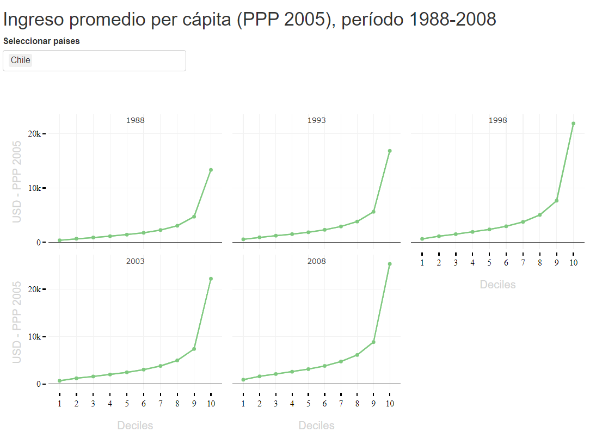

<style>
body {
text-align: justify}
</style>

# Libraries
Note that by loading *tidyverse*, other packages are loaded as well. You can review them [here](https://www.tidyverse.org/packages/).

```{r}
library(haven)
library(tidyverse)
library(scales)
library(ggthemes)
library(gganimate)
library(plotly)
library(ggiraph)
library(Cairo)

```

# Database
## Acquisition

Go to <a href="https://www.worldbank.org/en/research/brief/World-Panel-Income-Distribution" target="_blank">Lakner-Milanovic (2013) World Panel Income Distribution (LM-WPID)</a> and download the file in *STATA (.dta)* format.


## Import
Since the format is *.dta*, we use the **read_dta** command provided by the **haven** library.


```{r}
df <- read_dta("lm_wpid_web.dta")
attach(df)

```

## Visualization

See the variables we will use in constructing our graph. For more information on these and the dataset in general, check the [pdf](https://development-data-hub-s3-public.s3.amazonaws.com/ddhfiles/140634/laknermilanovic2013worldpanelincomedistributionlmwpiddescription_0.pdf).


```{r}
head(df)[c(1,8,9,11)]

```


# Graph
* The **filter()** command allows us to select the countries we want to graph.
* The [pipe operator](https://rsanchezs.gitbooks.io/rprogramming/content/chapter9/pipeline.html) **%>%** allows us to perform multiple operations.
* The **girafe()** command allows us to add a *tooltip*, making our graph more interactive. **geom_point_interactive()** should be added first.

```{r}
g1 <- df %>%
  
  filter(contcod %in% c("CHL", "ESP")) %>% 
  
  ggplot(aes(x = group, y = RRinc, color = contcod)) +
  geom_point_interactive(aes(tooltip = RRinc)) +
                           geom_line() +
  labs(title = "Average per Capita Income by Decile (PPP 2005)",
       subtitle = "Chile vs Spain, 1988-2008",
       caption = "Source: Own elaboration based on Lakner-Milanovic (2013)",
       x = "Deciles",
       y = "USD - PPP 2005",
       col = NULL) +
       scale_color_manual(values = c("#DA0000", "#C4961A")) +
       scale_x_continuous(breaks=seq(1,10, by = 1), position = "bottom") +
       scale_y_continuous(labels = dollar) +
       facet_wrap(~bin_year, ncol = 3) +
  theme(plot.title = element_text(size = rel(2)),
        plot.subtitle = element_text(size = rel(1.4),
                                     margin=margin(0,0,20,0)),
        plot.caption = element_text(size = rel(.9),
                                    hjust = 0,
                                    face= "italic",
                                    margin=margin(20,0,0,0)),
        axis.text.x = element_text(angle = 0, vjust=.5, size = 10),
        axis.text.y = element_text(angle = 0, vjust=.5, size = 10),
        axis.ticks.length.x = unit(.2, "cm"),
        axis.ticks.x = element_line(size = .3),
        axis.ticks.length.y = unit(.2, "cm"),
        axis.ticks.y = element_line(size = .3),
        panel.grid.major.x = element_line(colour = "grey87"),
        panel.grid.minor.x = element_line(colour = "grey92"),
        panel.grid.major.y = element_line(colour = "grey87"),
        panel.grid.minor.y = element_line(colour = "grey87"),
        legend.position = c(0.87, 0.22),
        legend.text = element_text(size = 13),
        legend.key.size = unit(3,"line"))

girafe(ggobj = g1, width_svg = 8, height_svg = 6)

```

## Save
```{r, echo=T}
# To save in png format
ggsave(g1, filename = "plot.png", type = 'cairo', dpi = 300,
       width = 8, height = 6)

# To save with higher quality (pdf or eps)
ggsave(g1, filename = "plot.pdf", device = cairo_pdf, dpi = 300,
       width = 8, height = 6)

ggsave(g1, filename = "plot.eps", device = cairo_ps, dpi = 300,
       width = 8, height = 6)
```

# More Graphics
## Chile vs Portugal
```{r code_folding = TRUE}
g2 <- df %>%
  
  filter(contcod %in% c("CHL", "PRT")) %>% 
  
  ggplot(aes(x = group, y = RRinc, color = contcod)) +
  geom_point_interactive(aes(tooltip = RRinc)) +
                           geom_line() +
  labs(title = "Average per Capita Income by Decile (PPP 2005)",
       subtitle = "Chile vs Portugal, 1988-2008",
       caption = "Source: Own elaboration based on Lakner-Milanovic (2013)",
       x = "Deciles",
       y = "USD - PPP 2005",
       col = NULL) +
       scale_color_manual(values = c("#DA0000", "#239f40")) +
       scale_x_continuous(breaks=seq(1,10, by = 1), position = "bottom") +
       scale_y_continuous(labels = dollar, limits = c(0, 30000)) +
       facet_wrap(~bin_year, ncol = 3) +
  theme(plot.title = element_text(size = rel(2)),
        plot.subtitle = element_text(size = rel(1.4),
                                     margin=margin(0,0,20,0)),
        plot.caption = element_text(size = rel(.9),
                                    hjust = 0,
                                    face= "italic",
                                    margin=margin(20,0,0,0)),
        axis.text.x = element_text(angle = 0, vjust=.5, size = 10),
        axis.text.y = element_text(angle = 0, vjust=.5, size = 10),
        axis.ticks.length.x = unit(.2, "cm"),
        axis.ticks.x = element_line(size = .3),
        axis.ticks.length.y = unit(.2, "cm"),
        axis.ticks.y = element_line(size = .3),
        panel.grid.major.x = element_line(colour = "grey87"),
        panel.grid.minor.x = element_line(colour = "grey92"),
        panel.grid.major.y = element_line(colour = "grey87"),
        panel.grid.minor.y = element_line(colour = "grey87"),
        legend.position = c(0.87, 0.22),
        legend.text = element_text(size = 13),
        legend.key.size = unit(3,"line"))

girafe(ggobj = g2, width_svg = 8, height_svg = 6)

```

## Chile vs Suecia
No data for Sweden in 1988.

```{r code_folding = TRUE}
g3 <- df %>%
  
  filter(contcod %in% c("CHL", "SWE")) %>% 
  
  ggplot(aes(x = group, y = RRinc, color = contcod)) +
  geom_point_interactive(aes(tooltip = RRinc)) +
                           geom_line() +
  labs(title = "Average per Capita Income by Decile (PPP 2005)",
       subtitle = "Chile vs Sweden, 1988-2008",
       caption = "Source: Own elaboration based on Lakner-Milanovic (2013)",
       x = "Deciles",
       y = "USD - PPP 2005",
       col = NULL) +
       scale_color_manual(values = c("#DA0000", "#293352")) +
       scale_x_continuous(breaks=seq(1,10, by = 1), position = "bottom") +
       scale_y_continuous(labels = dollar) +
       facet_wrap(~bin_year, ncol = 3) +
  theme(plot.title = element_text(size = rel(2)),
        plot.subtitle = element_text(size = rel(1.4),
                                     margin=margin(0,0,20,0)),
        plot.caption = element_text(size = rel(.9),
                                    hjust = 0,
                                    face= "italic",
                                    margin=margin(20,0,0,0)),
        axis.text.x = element_text(angle = 0, vjust=.5, size = 10),
        axis.text.y = element_text(angle = 0, vjust=.5, size = 10),
        axis.ticks.length.x = unit(.2, "cm"),
        axis.ticks.x = element_line(size = .3),
        axis.ticks.length.y = unit(.2, "cm"),
        axis.ticks.y = element_line(size = .3),
        panel.grid.major.x = element_line(colour = "grey87"),
        panel.grid.minor.x = element_line(colour = "grey92"),
        panel.grid.major.y = element_line(colour = "grey87"),
        panel.grid.minor.y = element_line(colour = "grey87"),
        legend.position = c(0.87, 0.22),
        legend.text = element_text(size = 13),
        legend.key.size = unit(3,"line"))

girafe(ggobj = g3, width_svg = 8, height_svg = 6)

```

## Chile vs Netherlands

```{r code_folding = TRUE}
g4 <- df %>%
  
  filter(contcod %in% c("CHL", "NLD")) %>% 
  
  ggplot(aes(x = group, y = RRinc, color = contcod)) +
  geom_point_interactive(aes(tooltip = RRinc)) +
                           geom_line() +
  labs(title = "Average per Capita Income by Decile (PPP 2005)",
       subtitle = "Chile vs Netherlands, 1988-2008",
       caption = "Source: Own elaboration based on Lakner-Milanovic (2013)",
       x = "Deciles",
       y = "USD - PPP 2005",
       col = NULL) +
       scale_color_manual(values = c("#DA0000", "#f37735")) +
       scale_x_continuous(breaks=seq(1,10, by = 1), position = "bottom") +
       scale_y_continuous(labels = dollar, limits = c(0, 40000)) +
       facet_wrap(~bin_year, ncol = 3) +
  theme(plot.title = element_text(size = rel(2)),
        plot.subtitle = element_text(size = rel(1.4),
                                     margin=margin(0,0,20,0)),
        plot.caption = element_text(size = rel(.9),
                                    hjust = 0,
                                    face= "italic",
                                    margin=margin(20,0,0,0)),
        axis.text.x = element_text(angle = 0, vjust=.5, size = 10),
        axis.text.y = element_text(angle = 0, vjust=.5, size = 10),
        axis.ticks.length.x = unit(.2, "cm"),
        axis.ticks.x = element_line(size = .3),
        axis.ticks.length.y = unit(.2, "cm"),
        axis.ticks.y = element_line(size = .3),
        panel.grid.major.x = element_line(colour = "grey87"),
        panel.grid.minor.x = element_line(colour = "grey92"),
        panel.grid.major.y = element_line(colour = "grey87"),
        panel.grid.minor.y = element_line(colour = "grey87"),
        legend.position = c(0.87, 0.22),
        legend.text = element_text(size = 13),
        legend.key.size = unit(3,"line"))

girafe(ggobj = g4, width_svg = 8, height_svg = 6)

```

## Chile vs Spain and Bolivia

```{r code_folding = TRUE}
g5 <- df %>%
  
  filter(contcod %in% c("CHL", "ESP", "BOL")) %>% 
  
  ggplot(aes(x = group, y = RRinc, color = contcod)) +
  geom_point_interactive(aes(tooltip = RRinc)) +
                           geom_line() +
   labs(title = "Average per Capita Income by Decile (PPP 2005)",
       subtitle = "Chile vs Spain and Bolivia, 1988-2008",
       caption = "Source: Own elaboration based on Lakner-Milanovic (2013)",
       x = "Deciles",
       y = "USD - PPP 2005",
       col = NULL) +
       scale_color_manual(values = c("#239f40", "#DA0000", "#C4961A")) +
       scale_x_continuous(breaks=seq(1,10, by = 1), position = "bottom") +
       scale_y_continuous(labels = dollar, limits = c(0, 30000)) +
       facet_wrap(~bin_year, ncol = 3) +
  theme(plot.title = element_text(size = rel(2)),
        plot.subtitle = element_text(size = rel(1.4),
                                     margin=margin(0,0,20,0)),
        plot.caption = element_text(size = rel(.9),
                                    hjust = 0,
                                    face= "italic",
                                    margin=margin(20,0,0,0)),
        axis.text.x = element_text(angle = 0, vjust=.5, size = 10),
        axis.text.y = element_text(angle = 0, vjust=.5, size = 10),
        axis.ticks.length.x = unit(.2, "cm"),
        axis.ticks.x = element_line(size = .3),
        axis.ticks.length.y = unit(.2, "cm"),
        axis.ticks.y = element_line(size = .3),
        panel.grid.major.x = element_line(colour = "grey87"),
        panel.grid.minor.x = element_line(colour = "grey92"),
        panel.grid.major.y = element_line(colour = "grey87"),
        panel.grid.minor.y = element_line(colour = "grey87"),
        legend.position = c(0.87, 0.22),
        legend.text = element_text(size = 13),
        legend.key.size = unit(3,"line"))

girafe(ggobj = g5, width_svg = 8, height_svg = 6)

```

# Interactive Plot

* To access the following link, click on the **[Shiny App](https://panchoguzman.shinyapps.io/Ingreso_promedio_pc_ppp_2005/)**.

```{r, echo=FALSE}


```

# Código
```{r ref.label=knitr::all_labels(), echo = T, eval = F, code_folding = TRUE}

```

# References 
* [Lakner-Milanovic (2013) World Panel Income Distribution (LM-WPID)](https://www.worldbank.org/en/research/brief/World-Panel-Income-Distribution)
* [Operador pipe](https://rsanchezs.gitbooks.io/rprogramming/content/chapter9/pipeline.html)
* [tidyverse](https://www.tidyverse.org/packages/)
