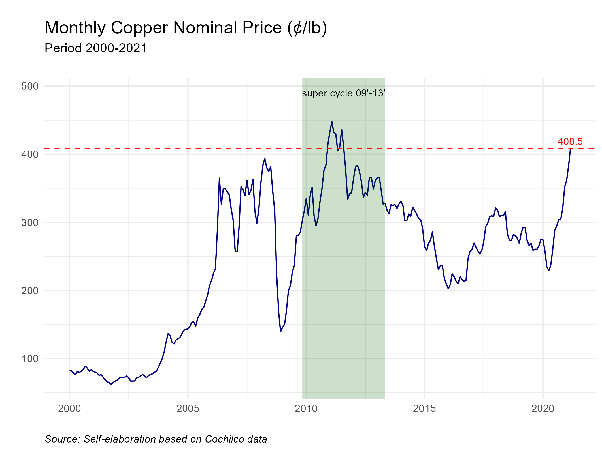

<style>
body {
text-align: justify}
</style>

```{r setup, include=FALSE}
knitr::opts_chunk$set(echo = FALSE)
```

# Step by Step

## Database

We need to go to <a href="https://boletin.cochilco.cl/estadisticas/grafico.asp?tipo_metal=1" target="_blank">Precios de los Metales e Inventarios</a>
and download the data. In this case, we'll work with the monthly price from Jan2000-Mar2021 (LME).

## Libraries
These must have been previously installed with the **install.packages()** command.

```{r, echo=TRUE}
library(readxl)
library(ggplot2)
library(tidyverse)
library(Cairo)

```

## Import Database

Make sure the database is saved in *.xlsx* format; it might be in a different format after downloading. After importing, we perform some modifications.

```{r, echo=TRUE}
df <- read_excel("datos.xlsx")

names(df)[1] <- "Date"
names(df)[2] <- "Price"

df$Date <- as.Date(df$Date)

```

## Graph

### ggplot()/geom_line()

Start with a simple graph.

```{r, echo=TRUE}
graph <- ggplot(data = df, aes(Date, Price)) +
  geom_line(colour = "navy")
graph
```

### labs()

We can add a title, subtitle, among other things.

```{r, echo=TRUE}
graph <- graph + labs(title = "Monthly Copper Nominal Price (¢/lb)",
                     subtitle = "Period 2000-2021",
       caption = "Source: Self-elaboration based on Cochilco data",
       tag = "",
       x = "",
       y = "")
graph
```

### theme_minimal()

Add a theme. See more options in <a href="https://ggplot2.tidyverse.org/reference/ggtheme.html" target="_blank">Complete themes</a>.

```{r, echo=TRUE}
graph <- graph + theme_minimal()
graph
```

### theme()

Edit the theme: title size, subtitle, font, margin, etc. See <a href="https://ggplot2.tidyverse.org/reference/theme.html#examples" target="_blank">Modify components of a theme</a> for more details.


```{r, echo=TRUE}
graph <- graph +
  theme(plot.title = element_text(size = rel(1.35)),
        plot.subtitle = element_text(size = rel(1), margin=margin(0,0,20,0)),
        plot.caption = element_text(hjust = 0, face= "italic"))
graph
```


### annotate()

Add a shaded rectangle to identify a more relevant period within the graph.

```{r, echo=TRUE}
graph <- graph +
  annotate("rect", fill = "darkgreen", alpha = 0.2,
           xmin = as.Date("2009-11-01"), xmax = as.Date("2013-05-01"),
           ymin = -Inf, ymax = Inf)
graph
```


### geom_point()/geom_text()

Identify a maximum point and place a label. Create *graph2* as this won't be added to our main graph.


```{r, echo=TRUE}
pmax <- df %>% #maximum price
  slice(which.max(Price))

graph2 <- graph +
  geom_point(data = pmax, aes(x = Date, y = Price), col = "red",
             shape = 21, fill = NA, size = 4, stroke = 1.1) +
  geom_text(data = pmax, aes(x = Date, y = Price,
                label = sprintf("%0.1f", round(Price, digits = 3))),
            size = 2.5, vjust = 0, hjust = -0.5)
graph2
```


### annotate()

Using *graph* again, add text with additional information about the highlighted period. See <a href="https://ggplot2.tidyverse.org/reference/annotate.html" target="_blank">Create an annotation layer</a> for more details.


```{r, echo=TRUE}
graph <- graph + 
  annotate(geom="text",x=as.Date("2011-08-01"),
           y=490, label="super cycle 09'-13'", fontface="plain", size=3)
graph
```

### geom_hline()/geom_text

Finally, add a line with the current value of copper (the most recent in the downloaded data) and create the corresponding label.

```{r, echo=TRUE}
plast <- df %>% #most recent price
  slice(which.max(Date))

graph <- graph +
  geom_hline(yintercept = tail(df$Price, n=1), linetype="dashed",
             color = "red", size = .5) +
  geom_text(data = plast,
            aes(x = Date, y = Price,
                label = sprintf("%0.1f", round(Price, digits = 3))), size = 3,
            vjust = -.5, hjust = .5, col = "red")

```


```{r}
ggsave(graph, filename = "plot.png", type = 'cairo', dpi = 300,
 width = 18, height = 13.5, units = "cm")



```


# Graph Code

```{r, echo=TRUE, fig.show='hide'}

plast <- df %>% #most recent price
  slice(which.max(Date))

ggplot(data = df, aes(Date, Price)) +
  geom_line(colour = "navy")+ 
  labs(title = "Monthly Copper Nominal Price (¢/lb)",
                      subtitle = "Period 2000-2021",
                      caption = "Source: Self-elaboration based on Cochilco data",
                      tag = "",
                      x = "",
                      y = "") + 
  theme_minimal() +
  theme(plot.title = element_text(size = rel(1.35)),
        plot.subtitle = element_text(size = rel(1), margin=margin(0,0,20,0)),
        plot.caption = element_text(hjust = 0, face= "italic")) +
  annotate("rect", fill = "darkgreen", alpha = 0.2,
           xmin = as.Date("2009-11-01"), xmax = as.Date("2013-05-01"),
           ymin = -Inf, ymax = Inf) +
  annotate(geom="text",x=as.Date("2011-08-01"),
           y=490, label="superciclo 09'-13'", fontface="plain", size=3) +
  geom_hline(yintercept = tail(df$Price, n=1), linetype="dashed",
             color = "red", size = .5) +
  geom_text(data = plast,
            aes(x = Date, y = Price,
                label = sprintf("%0.1f", round(Price, digits = 3))), size = 3,
            vjust = -.5, hjust = .5, col = "red")
```

# References

* <a href="https://ggplot2.tidyverse.org/reference/index.html" target="_blank">ggplot2</a>