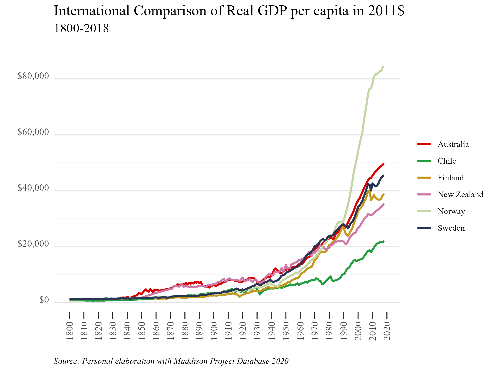

<style>
body {
text-align: justify}
</style>

# Libraries 
  
```{r}
library(readxl)
library(ggplot2)
library(plotly)
library(Cairo)
library(scales)
library(ggthemes)
library(dplyr)

```

# Database
## Import
We obtain the data from the <a href="https://www.rug.nl/ggdc/historicaldevelopment/maddison/releases/maddison-project-database-2020" target="_blank">Maddison Project Database 2020</a>. Then, we import it.

```{r}
mpd2020 <- as.data.frame(read_excel("mpd2020.xlsx", sheet = "Full data"))

```

## unique()
The following command might be useful for country selection. In this case, we'll compare Chile's growth with Norway, Sweden, Finland, New Zealand, and Australia.

```{r, results='hide'}
unique(mpd2020[c("countrycode", "country")])

```

## summary()
With the following command, we are interested in seeing the period that will be covered in the graph, considering the available data for Chile.

```{r}
mpd2020 %>% 
  filter(countrycode == "CHL") %>%
  summary()
```

We see that there is data for Chile from 1800, so the graph will start from that year.

## filter()
Given the information from the previous two steps, we filter the database to leave it with what we need. We can create a new one in case we need the complete database for something else.

```{r}
df_graf1 <- mpd2020 %>%
  filter(countrycode %in% c("CHL", "NOR", "SWE", "FIN", "NZL", "AUS"),
         year>=1800)

```

# Graph
## ggplot()

```{r}
my_palette = c("#DA0000", "#239f40", "#C4961A", "#CC79A7", "#C3D7A4", "#293352")

g1 <- ggplot(data = df_graf1, aes(year, gdppc, color=country)) +
  geom_line(size = 1) +
  labs(title = "International Comparison of Real GDP per capita in 2011$",
       subtitle = "1800-2018",
       caption = "Source: Personal elaboration with Maddison Project Database 2020",
       x = "",
       y = "",
       col = NULL) +
  scale_color_manual(values = my_palette) +
  scale_x_continuous(breaks=seq(1800,2020, by = 10), position = "bottom") +
  scale_y_continuous(labels = dollar) +
  theme_tufte() +
  theme(plot.title = element_text(size = rel(1.4)),
        plot.subtitle = element_text(size = rel(1.2), margin=margin(0,0,20,0)),
        plot.caption = element_text(hjust = 0, face= "italic"),
        axis.text.x = element_text(angle = 90, vjust=.5, size = 10),
        axis.text.y = element_text(angle = 0, vjust=0, size = 10),
        axis.ticks.length.x = unit(.25, "cm"),
        axis.ticks.x = element_line(size = .5),
        axis.ticks.y = element_blank(),
        panel.grid.major.y = element_line(colour = "grey90"),
        panel.grid.minor.y = element_line(colour = "grey90"))

```

```{r, echo=FALSE}
# To save in png format
ggsave(g1, filename = "plot.png", type = 'cairo', dpi = 300,
       width = 18, height = 13.5, units = "cm")

# For higher quality (pdf or eps)
ggsave(g1, filename = "plot.pdf", device = cairo_pdf, dpi = 300,
       width = 18, height = 13.5, units = "cm")

ggsave(g1, filename = "plot.eps", device = cairo_ps, dpi = 300,
       width = 18, height = 13.5, units = "cm")
```

```{r, echo=FALSE}


```

## plotly()
With this command, we get an interactive plot.

```{r}
fig <- ggplotly(g1)
fig
```


# Code

```{r ref.label=knitr::all_labels(), echo = T, eval = F, code_folding = TRUE}
```

# References 
* <a href="https://ggplot2.tidyverse.org/reference/index.html" target="_blank">ggplot2</a>

* <a href="https://plotly.com/ggplot2/" target="_blank">ggplotly</a>

* <a href="https://www.rug.nl/ggdc/historicaldevelopment/maddison/releases/maddison-project-database-2020" target="_blank">Maddison Project Database 2020</a>
  