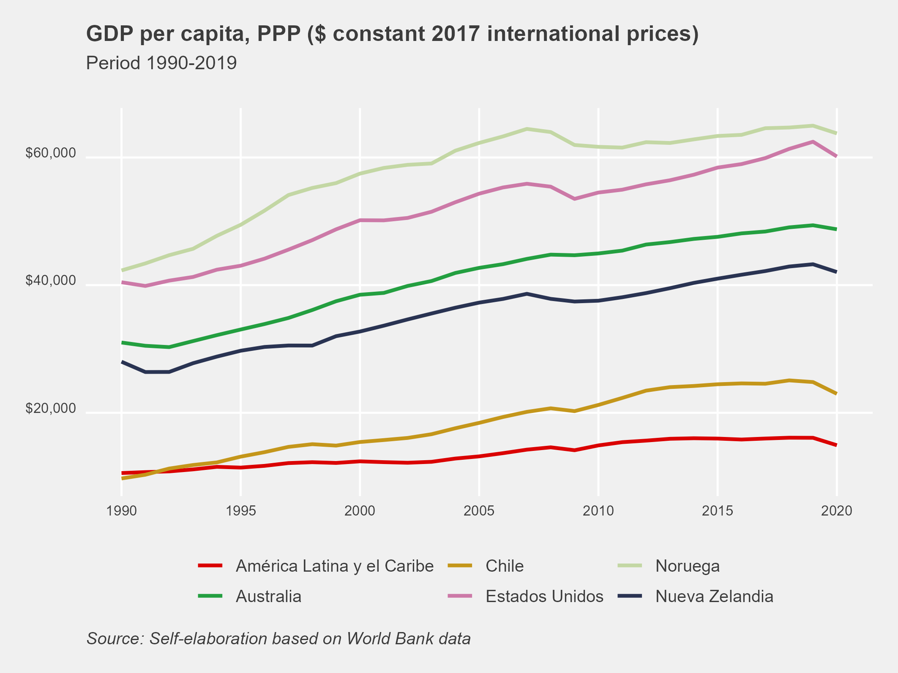

<style>
  body {
    text-align: justify;
  }

  h1, h2, h3, h4, h5, h6 {
    text-align: left; /* Adjust as needed */
  }

  /* For table of contents (toc) */
  /* Assuming your toc class is toc */
  .toc {
    text-align: left; /* Adjust as needed */
  }
</style>

# Libraries 

```{r}
library(WDI)
library(dplyr)
library(ggplot2)
library(ggthemes)
library(Cairo)
library(scales)

```

# Database

## Search
The **WDIsearch()** command is used to search for databases using keywords. In this case, we're interested in comparing the real GDP per capita of Chile, measured in PPP, so our keywords will be *gdp*, *ppp* and *constant*. This translates to the following:

```{r}
WDIsearch('gdp.*ppp.*constant')

```

From the 5 options displayed in the result, for the purpose of this article, we'll go with number 4: *"GDP per capita, PPP (constant 2017 international $)"*.

## Download
With the following command, we can get the database and apply previous filters.

```{r}
df <- WDI(
  country = "all",
  indicator = "NY.GDP.PCAP.PP.KD",
  start = 1990,
  end = 2020,
  extra = FALSE,
  cache = NULL,
  latest = NULL,
  language = "es"
)

```

## Modifications

### unique()/filter()
Using **unique()**, we view the country codes for selection, then apply **filter()**.


```{r, results='hide'}
unique(df[c("iso2c", "country")])
```

```{r}
df <- filter(df, iso2c %in% c("ZJ", "AU", "CL", "NZ", "NO", "US"))

```

### rename()
With **rename()**, we can modify variable names.


```{r}
df <- rename(df, gdp_pc = NY.GDP.PCAP.PP.KD)

```

### mutate()/recode()
These commands allow us to change category names.

```{r}
df <- df %>% mutate(country = recode(country,
                            "América Latina y el Caribe" = "América Latina y el Caribe"))
```

## Analysis
We analyze the ranking of countries according to GDP per capita for the year 2019.

```{r}
df %>% 
  filter(year == 2019) %>%
  select(country, gdp_pc) %>%
  arrange(-gdp_pc) %>% 
  head(6)

```

We compare the GDP per capita of Chile with New Zealand in 1990 and 2015.

```{r}
df %>% 
  filter(year %in% c(1990,2015) & iso2c %in% c("CL","NZ")) %>%
  select(country, year, gdp_pc)

```

# Graph

```{r}
my_palette = c("#DA0000", "#239f40", "#C4961A", "#CC79A7", "#C3D7A4", "#293352")

g1 <- ggplot(df, aes(year, gdp_pc, color=country)) +
  geom_line(size = 1) +
  labs(title = "GDP per capita, PPP ($ constant 2017 international prices)",
       subtitle = "Period 1990-2019",
       caption = "Source: Self-elaboration based on World Bank data",
       col = NULL) +
  scale_color_manual(values = my_palette) +
  scale_x_continuous(breaks=seq(1990,2020, by = 5)) +
  scale_y_continuous(labels = dollar) +
  theme_fivethirtyeight() +
  theme(plot.title = element_text(size = rel(1.05)),
        plot.subtitle = element_text(size = rel(.9), margin=margin(0,0,20,0)),
        plot.caption = element_text(hjust = 0, face= "italic"),
        axis.text.x = element_text(angle = 0, vjust=1, size = 8),
        axis.text.y = element_text(angle = 0, vjust=0, size = 8),
        legend.position = "bottom",
        panel.grid.major = element_line(colour = "white"))

```

```{r, echo=FALSE}
# Save in png format
ggsave(g1, filename = "plot.png", type = 'cairo', dpi = 300,
 width = 18, height = 13.5, units = "cm")

# Save in higher quality (pdf or eps)
ggsave(g1, filename = "plot.pdf", device = cairo_pdf, dpi = 300,
 width = 18, height = 13.5, units = "cm")

ggsave(g1, filename = "plot.eps", device = cairo_ps, dpi = 300,
 width = 18, height = 13.5, units = "cm")
```

```{r, echo=FALSE}

```

# Code

```{r ref.label=knitr::all_labels(), echo = T, eval = F, code_folding = TRUE}
```

# References

* <a href="https://ggplot2.tidyverse.org/reference/index.html" target="_blank">ggplot2</a>
* <a href="https://vincentarelbundock.github.io/WDI/" target="_blank">WDI</a>
