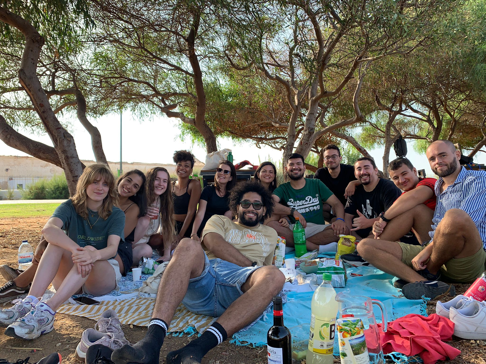

<style>
  body {
    text-align: justify;
  }

  h1, h2, h3, h4, h5, h6 {
    text-align: left; /* Adjust as needed */
  }

  /* For table of contents (toc) */
  /* Assuming your toc class is toc */
  .toc {
    text-align: left; /* Adjust as needed */
  }
</style>

```{r setup, include=FALSE}
knitr::opts_chunk$set(echo = FALSE)
```

Upon my arrival in Faro directly from Chile on February 23, 2022, I embarked on an enriching volunteering experience, beginning at Casa d’Alagoa. There, I worked closely with Julio, an adept in Brazilian cuisine, engaging in meal preparation, serving, and kitchen maintenance. Together, we curated traditional Brazilian dishes like feijoada, while Vittoria, Julio's partner, masterfully crafted the acclaimed dessert, Brigadeiro. Both Julio and Vitoria were multifaceted, mastering various tasks while I, as their eager apprentice, assisted them.

```{r, out.width = "40%", fig.align='center'}
knitr::include_graphics("IMG_1712.jpeg")

```

My shifts at Casa d’Alagoa, spanning three to five days a week, were characterized by multilingual interactions, blending Portuguese, English, and Spanish, fostering an atmosphere of camaraderie. Interacting with guests and witnessing the hostel's evolution into a genuine community space were among the highlights.

```{r, out.width = "55%", fig.align='center'}
knitr::include_graphics("image2.jpg")

```

```{r, out.width = "55%", fig.align='center'}
knitr::include_graphics("arg.jpeg")

```

Additionally, I contributed to the operations at Hostellicious, another establishment within the same chain, focusing on morning duties involving meticulous cleaning and organization. Beyond work, Hostellicious became a hub for daily routines, where I indulged in breakfast, acquired essential supplies, and occasionally discovered delightful offerings in the communal "free food" section.

```{r, out.width = "55%", fig.align='center'}
knitr::include_graphics("IMG_1690.jpeg")

```

My involvement at Hostellicious occurred sporadically, usually when additional assistance was required.

This phase as a volunteer was fundamental in facilitating my integration into a new country, aiding in linguistic acclimatization and cultural immersion. Engaging with individuals from varied nationalities fostered an environment conducive to learning and adapting.

Subsequently, this volunteering tenure laid the groundwork for my subsequent role within the hostel's formal employment, commencing a few months later.

```{r, out.width = "65%", fig.align='center'}


```

The photo below was the first photo I took of the city that welcomed me for almost 8 months. It is significant to me, as it marked my arrival in February 2022. I remember arriving at night and going for a walk. It was my first immersion in the new language, I learned the first words and headed to the Faro lettering sector to capture this image. I remember being a young man full of dreams, expectations for the future and great excitement for the experiences to come. Looking back, I am grateful for every decision I made and every opportunity that came my way. I appreciate having kept going through the hard times, facing the lowest moments with resilience and strength. Several months later, with more experience and wisdom, I am still a young man with dreams and challenges ahead, maintaining the determination to achieve my goals. The most important thing is to trust the process and dedicate myself completely to achieve it.

```{r}
knitr::include_graphics("faro.jpeg")

```
